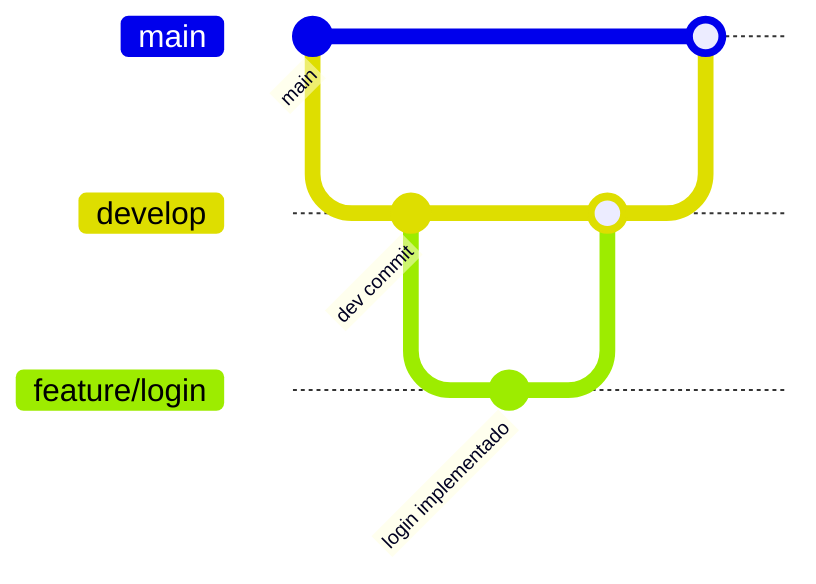

# 📦 Backend Iris - Blog API

Este repositório representa a API backend do projeto Iris, construída com **Flask**, persistência em **PostgreSQL**, e orquestrada com **Docker Compose**.

---

## 🚀 Tecnologias Utilizadas

- Python 3.10 / Flask
- PostgreSQL
- Docker & Docker Compose
- GitHub Actions
- NGINX (reverse proxy)

---

## 🌱 Fluxo de Branches


---

### ⚙️ Estrutura do Pipeline (CI/CD)

Pipeline automatizado com GitHub Actions, disparado em push para a `main`.

#### 1. `test`
- Inicia container PostgreSQL
- Configura ambiente virtual Python
- Instala dependências via `requirements.txt`
- Executa:
  - `pytest tests/user_test.py`
  - `pytest tests/comment_test.py`

#### 2. `build`
- Realiza login no Docker Hub
- Gera imagem `back:latest` via `docker build`
- Publica imagem para Docker Hub

#### 3. `deploy`
- Conecta via SSH a uma VM (Google Cloud)
- Cria dinamicamente o arquivo `.env`
- Faz pull da imagem `back:latest`
- Reinicia o container backend com as novas configurações e variáveis de ambiente

---

### 💻 Instruções para rodar localmente

#### 🔧 Requisitos

- Python 3.10+
- Docker e Docker Compose

#### 🔥 Subir com Docker Compose

```bash
docker-compose up --build
```

- O backend estará disponível em: `http://localhost:5000`

---

#### 📦 Executar testes localmente

```bash
python -m venv venv
source venv/bin/activate
pip install -r requirements.txt
pytest
```

---

### 🚢 Deploy em Produção

O deploy é feito automaticamente via **GitHub Actions**, conforme definido em `.github/workflows/main.yml`.

**Etapas:**

1. Merge da branch `develop` para `main`.
2. CI executa:
   -  Testes com Pytest
   -  Build + push da imagem para o Docker Hub
   -  SSH na VM (GCP)
   -  Criação do `.env` com secrets
   -  Parada e remoção do container anterior
   -  Pull da nova imagem
   -  Execução do container com `--env-file .env` e exposto em `5000`


---
